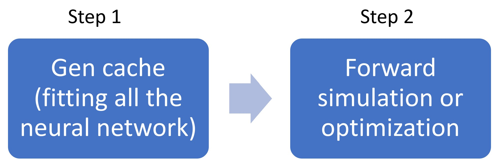

# Meta_SCMT
## Introduction
Meta_SCMT is a software to inverse design large-area dielectric metasurface. The key factor that differentiates the Meta_SCMT from current Local Periodic Approximation(LPA) based methods is that Meta_SCMT can achieve fullwave-level accuracy with much less computational resource. To achieve this, we made innovations on two sides. On the algorithm side, we model each meta unit as a waveguide, and the coupling between waveguides is fully considered using the spacial coupled-mode theory(SCMT). On the implementation side, complex numerical calculations of the mid-process are replaced by the fully-connected neural network, and software is designed to run on multi-GPUs.
## Note
* I am actively developing the software. So do expect some bugs. Please try to read the code if you encounter any bugs, or you can also reach out to me by email.
* when we say 1D waveguide, it only has a finite size along 1 direction. The 2D waveguide has a finite size in 2 directions.
* 1D waveguide array will become a 2D metasurface which is like a grating. 2D waveguide array will become a 3D metasurface.
* read the paper before running the code. (paper is in the citing section)

## Install
no installation is required. Just copy the Meta_SCMT directory to where you want to use the package. Although you don't need to install Meta_SCMT, you do need to install several common machine learning software which the Meta_SCMT are rely on. And we use Tidy3d or grcwa to do most fullwave validation and solve the Eigenmode of the waveguide.

## dependence
* python3
* Pytorch >= 1.9
* numpy
* tqdm
* pandas
* cv2
* seaborn
* sklearn
* tidy3d = v1.7.1 (https://www.flexcompute.com/tidy3d/)
* grcwa (https://github.com/weiliangjinca/grcwa)

## Metasurface inverse design
We provide 3 ways to simulate the forward process (solving the scattering field given the input field):
* Meta_SCMT: model dielectric meta-units as an array of waveguides.
* LPA: assume that the response of each meta unit can be approximated by the same meta unit with periodic boundary conditions.
* Ideal lens: Assume we can achieve arbitrary phase modification without any approximation.

Because we implement the whole process in PyTorch, the gradient of the loss function with respect to metasurface hyper-parameters can be automatically calculated. So any gradient-based optimization method can be supported by our framework. Currently, we are using Adam optimizer.

 
## Software structure
To begin the simulation, you should first define all the physical parameters (e.g. the wavelength, refractive index, period et al.) in GP class (Global parameter). Then pass the GP object to the Simulator Class. The simulator object will include all the methods you can use. (The code is in the examples)
 

## Hybrid with Neural network
To use SCMT to model an array of waveguides, we need to numerically calculate the eigenmode of each waveguide and the coupling coefficients of neighbor waveguides. To avoid repeated calculation during the forward process and also fully support the gradient back propagation, we use a neural network to fit some functions. E.g:
* given waveguide width output Eigen mode fields f(h) -> Es
* given waveguide width output effective refractive index f(h) -> n
* given 2 waveguides and the distance between them, output coupling coefficients. f(hi, hj, dis) -> Kij, Cij.\
 

We consider these processes as gen_cache processes. All these generated caches will be loaded during the forward or optimization process.

 
## Meta SCMT method
As we said, Meta SCMT method is designed to model metasurface with high accuracy and efficiency. The reason we can do that is we treat each meta unit as a waveguide. The optical property of the waveguide can be represented by its eigenmodes. And because the size of meta unit is usually smaller than the wavelength, only 1 or 2 modes will be supported. The accuracy is guaranteed by including the coupling between neighbor modes in the model. So the whole process will be the input field first coupled into the modes. Then the modes propagate in the waveguides. Finally couple out with the free space. 
 

## Local Periodic Approximation(LPA)
See paper: Pestourie, Raphaël, Carlos Pérez-Arancibia, Zin Lin, Wonseok Shin, Federico Capasso, and Steven G. Johnson. 2018. “Inverse Design of Large-Area Metasurfaces.” Optics Express 26 (26): 33732–47. https://doi.org/10.1364/OE.26.033732.

## Getting start
To get started, please go through the notebooks of the 1D or 2D waveguide examples (corresponding to 2D or 3D metasurface) in the examples/ directory. 
## Citing
read the paper before run the code.
@misc{wu2023inverse,
      title={Inverse design of dielectric metasurface by spatial coupled mode theory}, 
      author={Zhicheng Wu and Xiaoyan Huang and Nanfang Yu and Zongfu Yu},
      year={2023},
      eprint={2304.00603},
      archivePrefix={arXiv},
      primaryClass={physics.optics}
}
